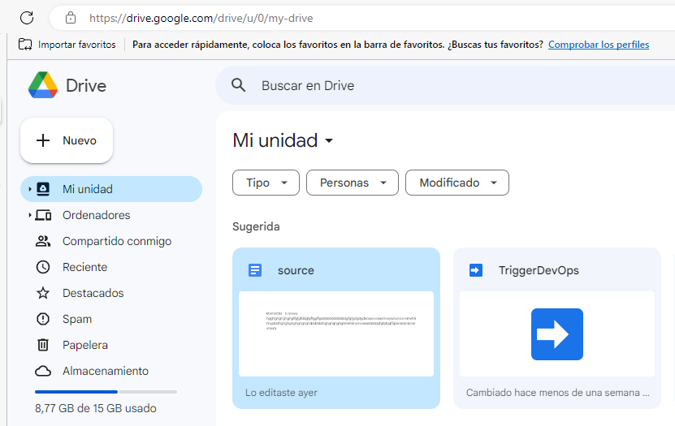
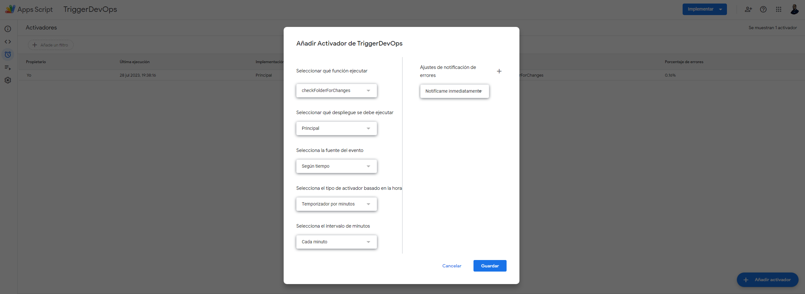
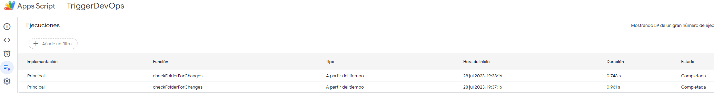
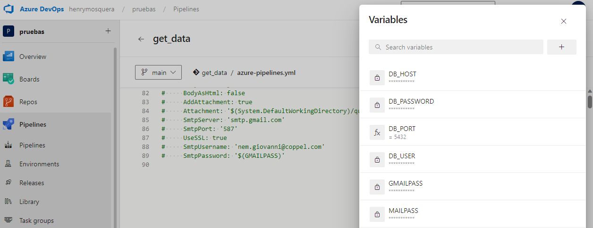
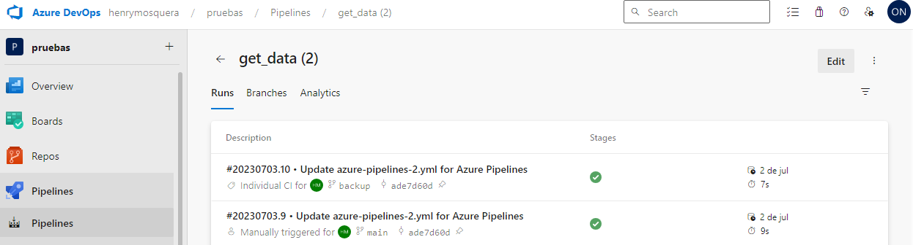

# Projects Release

## Enable the script in Google Drive

## Setting the script in Google Apps Scripts

## Setting the Azure DevOps Pipeline

## Validate the trigger in the Azure DevOps Pipeline

