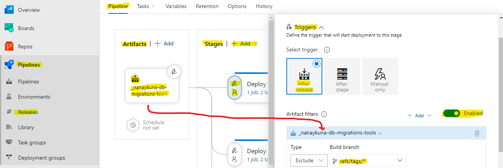

# Projects Release

## Enable Artifact after Build project pipeline in Continous Integration

## Include any commit for New Pull request from Development, Main, Feature

## Configure Task for cd.yml file in Azure DevOps project with Database Migrations

## Only PR from QA, Staging for Azure resources Deploys for Release Candidate

## Only PR from Mater, Production, hotfix for Azure resources Deploys with General Availability Release

## Configure Task for cd.yml file in Azure DevOps project with any Linux App Webs for Azure Resources Deploys

## Configure Task for cd.yml file in Azure DevOps project with any Static Webs App for Azure Resources Deploys

## Configure Task for cd.yml file in Azure DevOps project with any Linux Function Webs for Azure Resources Deploys

## Evidence ID Path for ci.yml file in Azure DevOps project with any Artifactory Feed Build for Version published to Azure

